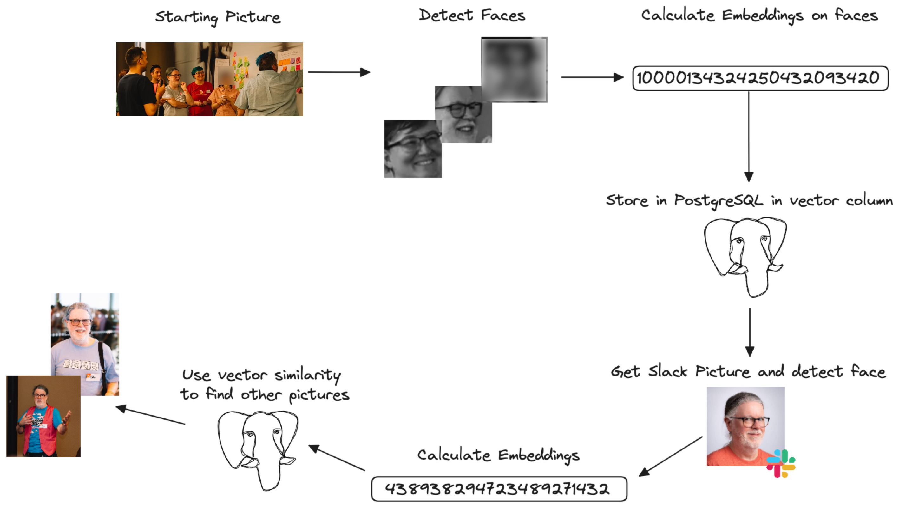

# faceclip-pgvector

Face recognition pipeline using **Python**, **OpenCV**, **OpenAI CLIP embeddings** (via [`imgbeddings`](https://github.com/aszot/imgbeddings)), and **PostgreSQL with pgvector** for efficient similarity search.  

Instead of comparing raw pixels, faces are represented as **embeddings** (high-dimensional vectors) that capture unique facial features. This makes recognition scalable, accurate, and efficient.

---

## Example

Original Image | Detected Faces
:-------------:|:-------------------------:
 | <p align="center"></p>

**Embedding space visualization**  
<p align="center"></p>

---

## How It Works
1. **Face Detection** – Extract faces from input images using OpenCV Haar Cascade.  
2. **Embeddings** – Convert detected faces into CLIP embeddings.  
3. **Database Storage** – Store embeddings in PostgreSQL with the `pgvector` extension.  
4. **Similarity Search** – Compare new face embeddings against stored ones to find the closest match.  

**Embeddings Explained**: An embedding is a numerical vector representing features of a face. Similar faces have vectors that are close together in the embedding space, while different faces are farther apart. PostgreSQL `pgvector` enables fast similarity queries using cosine or Euclidean distance.

---

## Installation
Clone the repo and install dependencies:
```bash
git clone https://github.com/Longman-max/faceclip-pgvector.git
cd faceclip-pgvector
pip install -r requirements.txt
